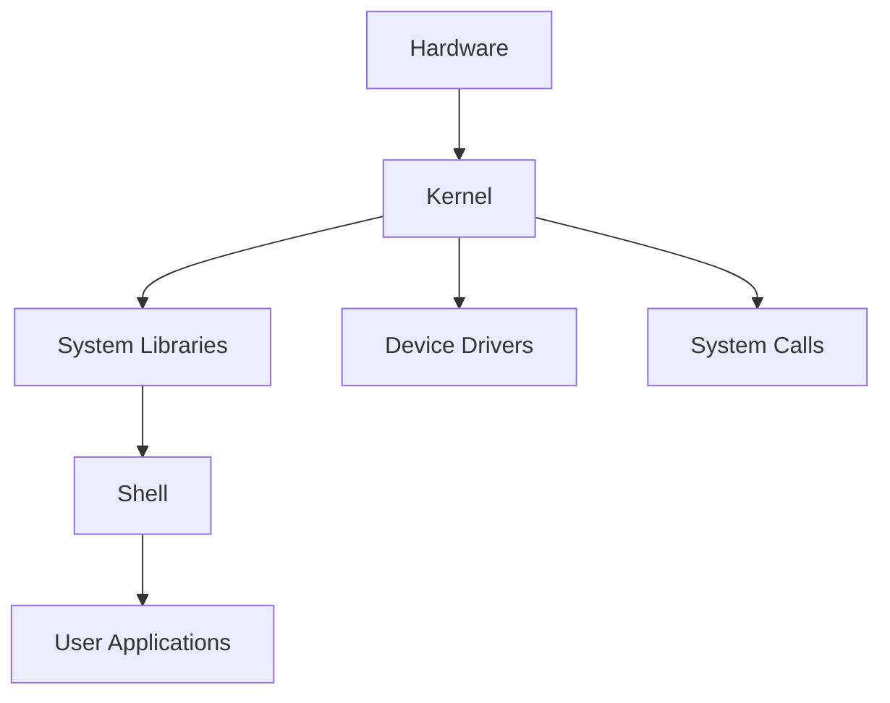

## 1. 컴퓨터의 구조

## 기본 데이터 흐름

컴퓨터에서의 데이터 처리 구조는 다음과 같이 정리할 수 있습니다.

`text사용자 → 응용 소프트웨어 → 운영체제(OS) → 하드웨어 → 출력/저장(드라이브 등)`

- **사용자**: 키보드, 마우스, 터치 등으로 명령하거나 입력을 함.
- **응용 소프트웨어**: 워드, 브라우저 등 사용자가 접하는 프로그램.
- **운영체제(OS)**: 응용 소프트웨어를 하드웨어와 연결, 자원 관리(Windows, macOS, Linux, iOS 등).
- **하드웨어**: CPU, 메모리, 저장장치, 입출력장치 등 실제 연산과 처리를 담당.
- **드라이브 출력**: 결과 데이터를 모니터(출력), 프린터(출력), 하드디스크/SSD(저장) 등으로 내보냄.

## 폰 노이만(John von Neumann) 구조

대부분의 현대 컴퓨터는 **폰 노이만 구조**(Von Neumann Architecture)를 따릅니다.

- **주요 특징**
    - **중앙처리장치(CPU)**, **메모리**, **입출력 장치**로 구성
    - **명령어와 데이터**가 모두 메모리에 저장되어, 동일한 버스(통로)를 이용해 CPU가 접근
    - 프로그램(명령어)이 저장된 형태로 실행되는 컴퓨터, 즉 **stored-program computer**
- **핵심 요소**: CPU(명령 처리), 메모리(프로그램/데이터 저장)

## 프로토콜

- **프로토콜**은 컴퓨터와 기기, 네트워크 등에서 서로 통신할 때 ‘어떤 방식으로, 어떤 규칙에 따라’ 데이터를 주고받을지 정해진 약속입니다.
- **종류가 다양**: 파일 복사, 인터넷 통신, 하드디스크 연결 등 각각의 상황과 목적에 따라 쓰이는 프로토콜이 다릅니다.
    - 예: HTTP(웹), FTP(파일전송), SATA(디스크 연결), USB(입출력), TCP/IP(네트워크) 등.

## 2. 컴퓨터의 정의와 본질

## 컴퓨터의 정의

- **컴퓨터**란 입력받은 데이터를 **논리적·수리적 명령(프로그램)에 따라 처리**하고, 그 결과를 출력하는 자동 처리 시스템입니다.
- "**전자적으로, 기계적으로 ‘계산’이나 ‘처리’를 수행하는 모든 기기**"가 넓은 의미의 컴퓨터입니다.

## 전화(폰)도 컴퓨터인가?

- **스마트폰 등 현대의 휴대폰(폰)은 내부적으로 CPU, 메모리, 저장장치, 운영체제, 소프트웨어가 동작**하기 때문에, 컴퓨터의 범주에 들어갑니다.
- 결과적으로, 스마트폰은 명백하게 **컴퓨터(소형화된, 통신기능이 추가된 컴퓨터)**라 말할 수 있습니다.

## 3. 애플: 소프트웨어&하드웨어 기업

- **애플(Apple Inc.)은 대표적으로 소프트웨어와 하드웨어를 모두 자체적으로 설계·생산하는 회사**입니다.
- **하드웨어**: 아이폰, 맥북, 아이패드 등 기기의 설계/생산
- **소프트웨어**: iOS, macOS, Safari, 각종 앱 등 직접 개발

## 아이폰의 포렌식(Forensics) 현황

- **아이폰은 포렌식(디지털 증거 분석, 즉 내부 데이터 추출 및 분석)이 매우 어렵거나, 불가능에 가까운 스마트폰 중 하나**로 평가받습니다.
- **주요 이유**
    - iOS 보안 구조: 암호화 칩(Secure Enclave), 강력한 잠금장치(암호, FaceID, TouchID 등), 폐쇄형 운영체제 설계
    - 파일 시스템과 데이터에 접근 권한이 엄격히 제한됨
    - 신규 OS/디바이스가 나올 때마다 보안이 더 강화됨
- **포렌식이 불가능하진 않지만,** 일반적인 수단(단순 복구, 루트 접근 등)으로는 데이터 추출이 거의 불가하며, 법 집행 기관도 특별한 해킹 장비·기법 없이는 해독에 실패하는 경우가 많음. 실제로 유명한 범죄 조사에서 "아이폰 데이터 잠금 해제에 실패"한 사례가 반복 보고됨.
- 반면, **일부 안드로이드 폰은 루팅 등으로 데이터에 접근이 상대적으로 쉬움**.

## 참고 요약

- **컴퓨터란 입력→계산→출력이라는 논리 흐름을 갖는 모든 정보 처리 기기를 말함**. 스마트폰, 태블릿, 내장형 시스템 모두 컴퓨터.
- **폰 노이만 구조**는 오늘날 PC/스마트폰 등 대부분 컴퓨터 설계의 기초가 된 방식.
- **애플 아이폰은 강력한 하드웨어·소프트웨어 통합과 보안 구조로 인해 포렌식이 극히 어렵거나 제한적**이라는 특성이 있습니다.

https://www.bbc.com/news/technology-38901850

https://www.nytimes.com/2020/02/06/technology/apple-iphone-encryption.html

기본 시스템 구조



- 하드웨어 → 커널 →SYstem Library(→shell→user Application(응용프로그램), Device Driver, System Calls

```
사용자
  ↓
응용 소프트웨어 (User Applications)
  ↓
쉘 (Shell)
  ↓
시스템 라이브러리 (System Libraries)
  ↓
커널 (Kernel)
 └→ 장치 드라이버 (Device Drivers)
 └→ 시스템 콜 (System Calls)
  ↓
하드웨어 (Hardware)
```

## **각 계층의 역할**

- **하드웨어(Hardware)**
    
    실제 물리적 장치(CPU, 메모리, 디스크, 네트워크 등).
    
    컴퓨터의 모든 연산과 데이터 처리를 담당합니다.
    
- **커널(Kernel)**
    
    OS의 핵심.
    
    하드웨어 자원을 직접 관리하고, 상위 계층(시스템 라이브러리, 쉘, 응용프로그램)에 안전하고 효율적인 자원 접근을 제공합니다.
    
    대표 역할 : 프로세스/스레드 관리, 메모리 관리, 파일 시스템, 장치 입출력 제어, 보안 및 권한 관리
    
    커널은 시스템 콜, 장치 드라이버 등으로 내부 기능을 외부에 제공합니다.
    
- **장치 드라이버(Device Drivers)**
    
    커널 안에서 하드웨어(프린터, 키보드, 디스크 등)와 직접 소통하는 모듈.
    
    새로운 하드웨어를 OS와 연결해주는 역할.
    
- **시스템 콜(System Calls)**
    
    응용 소프트웨어에서 커널로 요청을 보낼 수 있도록 해주는 인터페이스.
    
    예: 파일 열기/저장, 메모리 할당, 입출력 요청 등.
    
- **시스템 라이브러리(System Libraries)**
    
    응용 소프트웨어가 시스템 콜을 더 쉽고 직관적으로 쓸 수 있게 만드는 함수 집합.
    
    예: C의 stdio.h, stdlib.h
    
- **쉘(Shell)**
    
    사용자가 명령(텍스트나 그래픽)을 입력해 OS와 소통할 수 있는 인터페이스.
    
    CLI(shell), GUI(윈도우 탐색기 등) 모두 해당.
    
    쉘은 프로그래밍 언어이다? 명령어 방식, 스크립트 방식?
    
    - 즉, **쉘 스크립트는 일종의 프로그래밍 언어**이며, 쉘 자체는 명령어 해석기이만,“명령어 방식과 스크립트 방식(프로그래밍)”**모두 지원**한다는 게 쉘의 본질입니다
- **응용 소프트웨어(User Applications)**
    
    사용자에게 실제 서비스를 제공하는 프로그램(브라우저, 워드 등).
    
    주로 쉘이나 GUI를 통해 호출됨.
    

## **커널에 대해 좀 더 쉽게**

- **OS의 심장, 관리자**
    - 커널은 OS 중에서도 '심장' 역할을 하며 컴퓨터의 모든 핵심 운영을 담당합니다.
    - 하드웨어의 복잡한 동작을 일일이 신경 쓰지 않아도 되도록, 위 계층(응용프로그램)에게 자원(메모리, CPU, 디스크 등)의 사용을 ‘공정하고 안전하게’ 할당, 관리합니다.
- **자원 관리자, 보호자**
    - 어떤 프로그램이 CPU를 쓸지, 메모리는 얼마씩 줄지, 파일은 누가 어떻게 열 수 있을지 커널이 전담합니다.
    - 여러 프로그램이 동시에 실행되어도 충돌하지 않도록 보호합니다.
- **예시**
    - 파일 저장: 사용자가 저장 버튼을 누르면, 프로그램→라이브러리→커널을 통해 실제 디스크에 안전하게 저장됩니다.
    - USB 연결: 커널이 드라이버를 통해 새로운 장치를 인식하고 사용할 수 있게 만듭니다.
    
    **커널을 한마디로 요약**:
    
    "컴퓨터의 하드웨어와 사용자 프로그램(응용 소프트웨어) 사이에 위치해, 자원을 관리하고, 다양한 요청을 조정·보호하는 OS의 핵심 관리자."
    

## **시스템 구조를 머릿속에 이미지로 그리는 법**

1. **하드웨어**(실제 장치)와 **커널**(최중심 관리자)을 분명히 기억.
2. **응용 소프트웨어**는 제일 위, 사용자가 만지는 프로그램(Chrome, 한글 등).
3. **쉘**은 사용자와 시스템(커널) 사이의 대화 창구(GUI, CLI).
4. **시스템 라이브러리**는 애플리케이션과 커널 사이의 ‘번역사’ 역할.
5. **장치 드라이버**는 커널과 하드웨어를 연결하는 '어댑터'.
6. **모든 요청이 위에서 아래, 결과가 아래에서 위로 흐름**을 이해.

## **시스템 구조 흐름**

기본 시스템 구조에 대해 알아보겠습니다. 사용자는 응용프로그램을 실행하고 응용프로그램은 파일 읽기나 저장같은 동작을 요청합니다. 

이런 요청은 쉘, GUI를 통해 입력되고 시스템 라이브러리가 복잡한 요청을 대신 풀어서 OS가 쉽게 관리하게 만듭니다. 

요청이 커널에 도달하면 커널이 컴퓨터 자원을 어떻게 쓸지 결정하고 드라이버를 통해 하드웨어와 실제로 데이터를 주고 받습니다.

---

## Linux 시스템 디렉토리


- 리눅스는 디렉토리별로 디스크가 이어져 있어 복구 시간이 짧지만 윈도우는 하나의 디렉토리를 복구하거나 오류가 있으면 전체를 바꿔야한다.
    - 핵심 요약
        
        좋은 질문입니다. 말씀하신 리눅스와 윈도우의 **디스크 구조와 복구 방식의 차이**는 파일시스템의 운용 방식과 디스크 마운트 전략에 따른 구조적 차이에서 비롯됩니다. 아래에 좀 더 **정확하고 논리적인 설명**을 드릴게요.
        
        ## ✅ 핵심 요점 요약
        
        > 리눅스는 디스크나 파티션을 디렉토리 단위로 분리하여 마운트할 수 있기 때문에, 문제가 생긴 특정 디렉토리(=디스크)에 대해서만 복구가 가능합니다.
        > 
        > 
        > 반면, **윈도우는 각 디스크를 드라이브 단위(C:, D: 등)로 인식하며, 전체 시스템이 하나의 큰 파티션(C:)에 몰려 있는 경우가 많아, 일부 오류가 전체 시스템에 영향을 미칠 수 있어 복구 시 단위가 큽니다.**
        > 
        
        ## 1. 리눅스: 디렉토리 단위 분리 + 마운트 전략
        
        ## 구조적 특징
        
        - 리눅스는 모든 파일 시스템이 **단일 트리(root /)** 구조로 연결돼 있으며,
            
            **각 디렉토리에 다른 디스크나 파티션을 마운트할 수 있습니다.**
            
        - 예를 들어:
            
            `text/         ← 루트 (OS)
            └── /boot ← OS 부팅 정보 (별도 파티션)
            └── /home ← 사용자 데이터 (별도 디스크에 마운트)
            └── /var  ← 로그/캐시 등 시스템 데이터 (별도 파티션)`
            
        
        ## 복구 효율성
        
        - `/home`에 장애가 나도, `/var`나 `/`는 영향을 받지 않음. 즉, **디스크 수준 문제를 디렉토리 단위로 격리할 수 있음.**
        - 부팅 시 `/home`, `/var`가 마운트되지 않더라도, `/`로 로그인 가능한 **포괄적 시스템 가동**이 가능함.
        - 이 구조는 **서버 운영 효율성과 빠른 문제 대응이 가능**하게 만듬.
        
        ## 2. 윈도우: 드라이브 문자 단위 구조 (C:, D:, …)
        
        ## 구조적 특징
        
        - 윈도우는 파일 시스템을 **드라이브 단위(C:, D:, E: 등)**로 분리합니다.
        - 일반적인 사용자 시스템에서는 운영체제와 사용자 데이터가 모두 `C:`드라이브에 포함되어 있는 경우가 많습니다.
        
        ## 복구 한계점
        
        - `C:` 드라이브 자체에 오류가 생기면 **시스템, 사용자 데이터 전부가 영향을 받습니다.**
        - `home`처럼 계층적으로 디스크가 분리된 구조가 아니기 때문에, **작은 오류가 전체 시스템 재설치로 이어지는 리스크도 존재**합니다.
        - 윈도우도 여러 파티션을 나누는 건 가능하지만 기본값 구조(C: 드라이브 단일 구조)가 그런 구조적 단점을 갖게 합니다.
        
        ## 3. 명확한 근거: 파일 시스템적 차이
        
        | 항목 | 리눅스 | 윈도우 |
        | --- | --- | --- |
        | 마운트 구조 | 단일 루트 트리 구조, 디렉토리별 마운트 | 드라이브 문자(C:, D:) 단위로 분리 |
        | 일반적인 파티셔닝 | `/`, `/home`, `/boot`, `/var` 등 나눔 | 대부분 모든 시스템이 C:에 포함 |
        | 장애 시 영향 범위 | 해당 디렉토리 마운트만 복구하거나 분리 처리 | 많은 경우 C: 전체 복구 혹은 초기화 필요 |
        | 복구 유연성 | 부분 복구, 시스템 작동 유지 가능 | 전체 복구, OS 재설치 가능성 있음 |
        
        ## 📌 실무에서의 차이
        
        - **리눅스 서버 운영자**는 `/home`에만 디스크 장애가 발생해도, 다른 파티션은 유지하면서 오류 파티션만 복구하거나 재마운트 가능.
        - **윈도우 사용자**는 디스크 오류로 `C:`가 망가지면 OS 부팅 자체가 불가능해지고, **전체 복원 지점**이나 **포맷 후 재설치**로 가는 경우가 많음.
        
        ## ✅ 결론
        
        - **리눅스는 디렉토리 구조 단위 마운트(유연한 트리 구조)** 덕분에, **문제 디스크만 선택적으로 복구 가능**합니다.
        - **윈도우는 디스크 공간을 드라이브 문자 단위로 관리**하며, 일반적으로 `C:` 하나에 시스템, 앱, 데이터가 모두 포함되어 있어서, **복구 시 전체 단위를 만져야 하는 경우가 많습니다.**
        
        > 따라서, 디스크 구조 측면에서 리눅스가 부분 복구에 유리하고, 트러블슈팅과 유지관리에 효율적인 체계를 갖췄다고 볼 수 있습니다.
        > 
        
        ---
        

---

## Linux 명령어 기본 형식

```
명령어_옵션_대사음
```

- ls -a ~ : ~로 이동하지 않고 홈 디렉토리 안에 내용을 볼 수 있다.

- cd /~~~~ : /로 시작하면 절대경로이다.

```
[hwang@localhost ~]$ mkdir temp
[hwang@localhost ~]$ ls
Desktop    Downloads  my_project         Pictures  Public  Templates
Documents  Music      my_project_backup  practice  temp    Videos
[hwang@localhost ~]$ ls -la temp
total 4
drwxr-xr-x.  2 hwang hwang    6 Jul 16 14:59 .
drwx------. 18 hwang hwang 4096 Jul 16 14:59 ..
```

- `. , ..` 은 메타데이터 → 상대경로
    - 링크드 리스트로 연결되어있는 디렉토리 구조
    - 핵심 요약
        
        좋은 질문입니다! 🙂
        
        리눅스나 유닉스 계열 시스템에서의 파일 시스템 구조에서 등장하는 **`.`과 `..` (점과 점점)**은 **디렉토리 내에 항상 존재하는 특별한 항목(엔트리)**이며, 파일 시스템의 **내부 구조(특히 디렉토리 간 링크 방식)**와 관련이 있습니다.
        
        아래에서 쉽게 정리해드릴게요👇
        
        ## ✅ `.` 과 `..` 의 의미
        
        | 기호 | 의미 | 용도 |
        | --- | --- | --- |
        | `.` | 현재 디렉토리(Current Dir) | 자기 자신을 가리킴 |
        | `..` | 상위 디렉토리(Parent Dir) | 현재 디렉토리의 부모 디렉토리를 가리킴 |
        
        이 두 항목은 **모든 디렉토리에 자동으로 존재**하며, 사용자가 특별히 만들지는 않아도 파일 시스템이 내부적으로 항상 관리합니다.
        
        예시:
        
        `bash$ ls -a
        .  ..  file.txt  dir/`
        
        ## ✅ 메타데이터인가요?
        
        **네, 맞습니다.**
        
        `., ..`은 **디렉토리 상의 항목(entry)이면서, 파일 시스템의 메타데이터 중 일부**입니다.
        
        - 파일이든 디렉토리든 리눅스에서 **모든 엔트리는 inode라는 메타데이터 블록과 연결**됩니다.
        - `.`은 현재 디렉토리의 inode를, `..`은 부모 디렉토리의 inode를 참조합니다.
        - 즉, 점(`.`)과 점점(`..`)은 **특수한 형태의 심볼릭 링크가 아닌, 고정된 디렉토리 참조**입니다.
        
        ## ✅ 디렉토리 구조는 링크드 리스트인가?
        
        **엄밀히 말하면 디렉토리 구조는 링크드 리스트(linked list)라기보다는 트리(tree) 구조**에 가깝지만,
        
        **디렉토리 내부에서 `..` 때문에 양방향 연결이 가능하기 때문에 "양방향 링크드 리스트와 유사한 특성"**도 있습니다.
        
        ## 디렉토리 구조 요약
        
        - **파일 시스템의 전체 구조**는 **트리(Tree)** 형태입니다.
            - 루트 `/`을 최상위로 하여 하위 디렉토리와 파일이 계층적으로 연결됨
            - 예: `/home/user/docs`
        - **디렉토리 내부 관점**에서는 `.`과 `..`이라는 특수 항목 덕분에
            - 자신(`.`)과 부모 디렉토리(`..`)를 가리키는 **연결 포인터(링크)**가 존재
            - 결과적으로 디렉토리는 **양방향 탐색이 가능한 리스트 형태**도 일부 포함
        
        > 📌즉:
        > 
        > - 전체는 **트리 구조**
        > - 디렉토리 내부에는 `..`으로 **부모를 역참조**할 수 있기 때문에, 일종의 **양방향 링크**된 노드처럼 동작합니다
        
        ## ✅ 실제 예시로 이해하기
        
        `bash$ cd /home/user
        
        $ ls -li
        123456 .    → 현재 디렉토리 (inode 123456)
        123000 ..   → 상위 디렉토리(즉, /home)의 inode (inode 123000)`
        
        - `.`은 자신을 가리키고
        - `..`은 상위 폴더 `/home`을 가리킵니다
        - 이는 커널이 파일 탐색을 할 때 **inode 번호로 디스크 상의 위치를 찾아가는 방식**으로 동작합니다
        
        ## ✅ 요약 정리
        
        | 항목 | 설명 |
        | --- | --- |
        | `.` / `..` | 각각 현재 디렉토리 / 부모 디렉토리의 메타데이터 엔트리 |
        | 메타데이터 | 맞습니다. 디렉터리 항목이자 inode 번호로 하드 디스크 위치를 참조 |
        | 디렉토리 구조 방식 | 전체는 **트리(Tree)** 구조, 내부적으로는 `..` 링크로 인해 **양방향 참조 가능** |
        | 용도 | 경로 탐색, 디렉토리 이동, 파일 시스템 순회 등에 사용됨 |
        
        🧠 한 문장 요약:
        
        > 리눅스의 ., ..은 디렉토리 내의 **특수 메타데이터 항목(entry)**이며, 전체 파일 시스템은 트리 구조지만, .. 덕분에 디렉토리 간에는 링크드 리스트처럼 양방향 탐색이 가능한 구조입니다.
        > 
        
        필요하시면 이 내용 시각자료(구조도)로도 정리해드릴게요.
        

## 상대경로

상대경로는 **현재 작업 중인 디렉토리(폴더)를 기준**으로 다른 파일이나 디렉토리의 위치를 나타내는 방법입니다. 즉, 내 위치(현재 디렉토리)에서 상대적으로 어디에 있냐를 표시하는 방식이죠[1](https://velog.io/@bami/%ED%8C%8C%EC%9D%BC-%EA%B2%BD%EB%A1%9C-%EC%A0%88%EB%8C%80-%EA%B2%BD%EB%A1%9C%EC%99%80-%EC%83%81%EB%8C%80-%EA%B2%BD%EB%A1%9C)[3](https://sosodev.tistory.com/entry/Fedora-%EC%A0%88%EB%8C%80%EA%B2%BD%EB%A1%9C-vs-%EC%83%81%EB%8C%80%EA%B2%BD%EB%A1%9C-%EC%95%8C%EC%95%84%EB%B3%B4%EA%B8%B0)[4](https://wonkang.tistory.com/28)[5](https://linuxpia.tistory.com/601)[6](https://www.lainyzine.com/ko/article/understanding-linux-absolute-and-relative-paths/).

## 대표적인 상대경로의 예시

- `./file.txt` → 현재 디렉토리에 있는 `file.txt`
- `../images` → 현재 위치의 **상위 디렉토리**에 있는 `images` 폴더
- `../../data.csv` → 상위 디렉토리의 상위(두 단계 위)에서 `data.csv`
- `cd ../` → 상위 디렉토리 선택

여기서 `.`은 **현재 디렉토리**, `..`은 **부모(상위) 디렉토리**를 의미합니다[2](https://titanic1997.tistory.com/3)[6](https://www.lainyzine.com/ko/article/understanding-linux-absolute-and-relative-paths/).

## 상대경로의 특징과 장점

- **현재 위치를 기준**으로 해석되므로, 어디에서 명령을 실행하냐에 따라 실제 경로가 달라질 수 있습니다[3](https://sosodev.tistory.com/entry/Fedora-%EC%A0%88%EB%8C%80%EA%B2%BD%EB%A1%9C-vs-%EC%83%81%EB%8C%80%EA%B2%BD%EB%A1%9C-%EC%95%8C%EC%95%84%EB%B3%B4%EA%B8%B0)[5](https://linuxpia.tistory.com/601).
- 프로젝트 구조나 디렉토리 위치가 바뀌어도 내부 구조가 같으면, 상대경로는 별도 수정 없이 계속 활용할 수 있어서 편리합니다[1](https://velog.io/@bami/%ED%8C%8C%EC%9D%BC-%EA%B2%BD%EB%A1%9C-%EC%A0%88%EB%8C%80-%EA%B2%BD%EB%A1%9C%EC%99%80-%EC%83%81%EB%8C%80-%EA%B2%BD%EB%A1%9C)[9](https://jettstream.tistory.com/7).
- 외부에서 항상 동일한 경로를 가리키는 **절대경로**와 달리, 상대경로는 작업할 때 좀 더 유연하고 간결합니다[3](https://sosodev.tistory.com/entry/Fedora-%EC%A0%88%EB%8C%80%EA%B2%BD%EB%A1%9C-vs-%EC%83%81%EB%8C%80%EA%B2%BD%EB%A1%9C-%EC%95%8C%EC%95%84%EB%B3%B4%EA%B8%B0)[6](https://www.lainyzine.com/ko/article/understanding-linux-absolute-and-relative-paths/).

## 연결: `.`과 `..`, 그리고 상대경로

리눅스 등에서 `.`과 `..`은 **특수 메타데이터**로, 각각 **현재 디렉토리와 상위(부모) 디렉토리**를 뜻합니다.

상대경로를 사용할 때 이 기호를 자주 활용하며, **트리 구조의 디렉토리 탐색이 훨씬 효율적**이 됩니다.

**한 줄 요약:**

> 상대경로는 지금 있는 위치(현재 디렉토리)를 기준으로 파일이나 폴더의 상대적인 위치를 표현하는 방법이며, .(현재 디렉토리), ..(상위 디렉토리)라는 특수 기호와 함께 많이 쓰입니다.
> 
> 
> 작업 환경이 바뀌어도 같은 내부 구조에서는 쉽게 파일을 찾고 관리할 수 있다는 장점이 있습니다
> 

# **리눅스 상대 주소 실습 문제**

## **사전 준비: 실습 환경 설정**

다음 명령어로 실습 환경을 준비하세요:

1. 1mkdir -p ~/practice/project/{src,docs,tests,config}
2. mkdir -p ~/practice/project/src/{main,utils}
3. mkdir -p ~/practice/project/docs/{user,dev}
4. mkdir -p ~/practice/project/tests/unit
5. touch ~/practice/project/src/main/app.py
6. touch ~/practice/project/docs/dev/api.md
7. touch ~/practice/project/tests/test_main.py

완성된 디렉토리 구조:

```
├── practice
│   └── project
│       ├── config
│       │   └── settings.conf
│       ├── docs
│       │   ├── dev
│       │   │   └── api.md
│       │   └── user
│       │       └── manual.txt
│       ├── README.md
│       ├── src
│       │   ├── main
│       │   │   └── app.py
│       │   └── utils
│       │       └── helper.py
│       └── tests
│           ├── test_main.py
│           └── unit

```

---

## **연습문제 1: 기본 상대 주소 이해**

1-1. 현재 위치에서 상대 주소 작성

현재 위치가 ~/practice/project/src/main/일 때, 다음 파일들로 이동하는 상대 주소를 작성하시오:

1. helper.py 파일 생성
2. README.md 파일 생성
3. manual.txt 파일 생성
4. settings.conf 파일 생성

**1-2. 상대 주소 검증**

위에서 작성한 상대 주소가 정확한지 다음 명령어로 확인하시오:

1. cd ~/practice/project/src/main/

---

## **연습문제 2: 다양한 시작점에서의 상대 주소**

**2-1. 시작점 변경 실습**

현재 위치가 ~/practice/project/docs/user/일 때:

1. app.py 파일로 이동하는 상대 주소를 작성하시오.

```
[hwang@localhost unit]$ cd ./../../docs/user
[hwang@localhost user]$ cd ./../../src/main
[hwang@localhost main]$ ls
app.py
```

1. test_main.py 파일을 상대 주소를 작성하시오.

```
[hwang@localhost user]$ cd ./../../tests/tesst_main.py
```

1. src/utils/ 디렉토리로 이동하는 상대 주소를 작성하시오.

```
[hwang@localhost user]$ cd ./../../src/utils
```

**2-2. 역방향 상대 주소**

현재 위치가 ~/practice/project/tests/unit/일 때:

1. 프로젝트 루트(~/practice/project/)로 이동하는 상대 주소를 작성하시오.
    
    ```
    hwang@localhost unit]$ cd ./../../
    [hwang@localhost project]$ 
    ```
    
2. api.md 파일로 이동하는 상대 주소를 작성하시오.
    
    ```
    [hwang@localhost unit]$ cd ./../../docs/dev/
    [hwang@localhost dev]$ ls
    api.md
    ```
    
3. helper.py 파일을 상대 주소를 작성하시오.
    
    ```
    [hwang@localhost unit]$ cd ./../../src/utils/
    [hwang@localhost utils]$ ls
    helper.py
    ```
    

---

## **연습문제 3: 파일 내용 확인 및 조작**

**3-1. 상대 주소를 이용한 파일 내용 출력**

현재 위치가 ~/practice/project/src/utils/일 때:

1. 프로젝트 루트의 README.md 파일 내용을 출력하시오.
    
    ```
    [hwang@localhost utils]$ cd ./../../
    [hwang@localhost project]$ cat README.md
    ```
    
2. docs/user/manual.txt 파일 정보 자세히 출력하시오.
    
    ```
    [hwang@localhost utils]$ cd ./../../docs/user/
    [hwang@localhost user]$ cat manual.txt
    ```
    
3. config/settings.conf 파일 정보 자세히 출력하시오.
    
    ```
    [hwang@localhost utils]$ cd ./../../config/
    [hwang@localhost config]$ cat setting.conf
    ```
    

**3-2. 상대 주소를 이용한 파일 생성**

현재 위치가 ~/practice/project/src/main/일 때:

1. 현재 디렉토리에 config.py 파일을 생성하고 "# Configuration module"이라는 내용을 작성하시오.
    
    ```
    [hwang@localhost main]$ echo "# Configuration module" > config.py
    ```
    
2. tests/ 디렉토리에 test_app.py 파일을 생성하고 "# App test file"이라는 내용을 작성하시오.
    
    ```
    [hwang@localhost main]$ cd ./../../tests/
    [hwang@localhost tests]$ echo "# App test file" > test_app.py
    [hwang@localhost tests]$ ls
    test_app.py  test_main.py  unit
    ```
    

---

## **연습문제 4: 파일 복사 및 이동**

**4-1. 상대 주소를 이용한 파일 복사**

현재 위치가 ~/practice/project/docs/dev/일 때:

1. api.md 파일을 docs/user/ 디렉토리에 api_copy.md로 복사하시오.
    
    ```
    [hwang@localhost dev]$ cp api.md ./../user/api_copy.md
    ```
    
2. src/utils/helper.py 파일을 현재 디렉토리에 복사하시오.
    
    ```
    [hwang@localhost dev]$ cp ./../../src/utils/helper.py  .
    [hwang@localhost dev]$ ls
    api.md  helper.py
    ```
    
3. config/settings.conf 파일을 tests/unit/ 디렉토리에 복사하시오.
    
    ```
    [hwang@localhost dev]$ cp ./../../config/settings.conf ./../../tests/unit/
    ```
    

**4-2. 상대 주소를 이용한 파일 이동**

현재 위치가 ~/practice/project/tests/일 때:

1. test_main.py 파일을 tests/unit/ 디렉토리로 이동하시오.
    
    ```
    [hwang@localhost tests]$ mv test_main.py unit/
    ```
    
2. src/main/config.py 파일을 config/ 디렉토리로 이동하시오.
    
    ```
    [hwang@localhost tests]$ mv ./../src/main/config.py ./../config/
    ```
    

---

## **연습문제 5: 복합 상대 주소 활용**

**5-1. 다중 파일 조작**

현재 위치가 ~/practice/project/일 때:

1. src/main/ 디렉토리의 모든 파일을 docs/dev/ 디렉토리에 복사하시오.
    
    ```
    [hwang@localhost project]$ cp -r src/main/ docs/dev/
    [hwang@localhost project]$ cd docs/dev/
    [hwang@localhost dev]$ ls
    api.md  helper.py  main
    ```
    
2. docs/user/ 디렉토리의 모든 파일을 tests/unit/ 디렉토리로 이동하시오.
    
    ```
    [hwang@localhost project]$ mv docs/user/ tests/unit/
    ```
    
3. config/ 디렉토리 전체를 backup_config/로 복사하시오.
    
    ```
    [hwang@localhost project]$ cp -r config/ backup_config/
    [hwang@localhost project]$ tree
    .
    ├── backup_config
    │   ├── config.py
    │   └── settings.conf
    ├── config
    │   ├── config.py
    │   └── settings.conf
    ├── docs
    │   └── dev
    │       ├── api.md
    │       ├── helper.py
    │       └── main
    │           └── app.py
    ├── README.md
    ├── src
    │   ├── main
    │   │   └── app.py
    │   └── utils
    │       └── helper.py
    └── tests
        ├── test_app.py
        └── unit
            ├── settings.conf
            ├── test_main.py
            └── user
                ├── api_copy.md
                └── manual.txt
    
    ```
    

---

## **연습문제 6: 에러 찾기 및 수정**

**6-1. 잘못된 상대 주소 찾기**

현재 위치가 ~/practice/project/docs/user/일 때, 다음 명령어들 중 에러가 있는 것을 찾고 올바른 명령어로 수정하시오:

```
1. # A
2. ls ../../../project/src/main/
3. 
4. # B
5. cat ../../src/utils/helper.py
6. 
7. # C
8. cd ../dev/../../config/
9.  cd ../../dev/../../config/
10. # D
11. cp manual.txt ../../tests/unit/backup.txt
12. 
13. # E
14. mv api_copy.md ../../../src/main/

```

**6-2. 경로 최적화**

다음 상대 주소를 더 간단하게 최적화하시오:

현재 위치: ~/practice/project/tests/unit/

1. ../../src/main/../utils/helper.py
    
    ```
    ../../src/utils/helper.py
    ```
    
2. ../../docs/user/../dev/api.md
    
    ```
    ../../docs//dev/api.md
    ```
    
3. ../../config/../README.md
    
    ```
    ../../README.md
    ```
    

---

## **연습문제 7: 종합 실습**

**7-1. 프로젝트 구조 재정리**

현재 위치가 ~/practice/project/일 때, 다음 작업을 수행하시오:

1. src/main/ 디렉토리에 models/ 하위 디렉토리를 생성하시오.
    
    ```
    [hwang@localhost project]$ mkdir ./src/main/models/
    [hwang@localhost project]$ cd ./src/main/models/
    [hwang@localhost models]$ 
    ```
    
2. docs/ 디렉토리에 README.md 파일을 생성하고 "# Project Documentation"이라는 내용을 작성하시오.
    
    ```
    [hwang@localhost project]$ echo "# Project Documentation" > docs/README.md
    [hwang@localhost project]$ cat docs/README.md
    # Project Documentation
    ```
    
3. tests/unit/ 디렉토리의 모든 파일을 tests/ 디렉토리로 이동하시오.
    
    ```
    [hwang@localhost project]$ mv tests/unit/*  tests/
    [hwang@localhost project]$ ls ./tests/
    settings.conf  test_app.py  test_main.py  unit  user
    ```
    
4. config/ 디렉토리의 모든 파일을 src/ 디렉토리에 복사하시오.
    
    ```
    [hwang@localhost project]$ cp -r config/ src/
    ```
    

**7-2. 백업 및 정리**

```
[hwang@localhost practice]$ tree
.
└── project
    ├── backup_config
    │   ├── config.py
    │   └── settings.conf
    ├── config
    │   ├── config.py
    │   └── settings.conf
    ├── docs
    │   ├── dev
    │   │   ├── api.md
    │   │   ├── helper.py
    │   │   └── main
    │   │       └── app.py
    │   └── README.md
    ├── README.md
    ├── src
    │   ├── config
    │   │   ├── config.py
    │   │   └── settings.conf
    │   ├── main
    │   │   ├── app.py
    │   │   └── models
    │   └── utils
    │       └── helper.py
    └── tests
        ├── settings.conf
        ├── test_app.py
        ├── test_main.py
        ├── unit
        └── user
            ├── api_copy.md
            └── manual.txt

```

현재 위치가 ~/practice/project/src/main/일 때:

1. 전체 프로젝트를 ../../project_backup/으로 복사하시오.
    
    ```
    [hwang@localhost main]$ cp -r ../../../* ../../../project_backup/
    cp: cannot copy a directory, '../../../project_backup', into itself, '../../../project_backup/project_backup'
    [hwang@localhost main]$ cp ../../../* ../../../project_backup/
    cp: -r not specified; omitting directory '../../../project'
    cp: -r not specified; omitting directory '../../../project_backup'
    [hwang@localhost main]$ cd ../../..
    [hwang@localhost practice]$ tree
    .
    ├── project
    │   ├── backup_config
    │   │   ├── config.py
    │   │   └── settings.conf
    │   ├── config
    │   │   ├── config.py
    │   │   └── settings.conf
    │   ├── docs
    │   │   ├── dev
    │   │   │   ├── api.md
    │   │   │   ├── helper.py
    │   │   │   └── main
    │   │   │       └── app.py
    │   │   └── README.md
    │   ├── README.md
    │   ├── src
    │   │   ├── config
    │   │   │   ├── config.py
    │   │   │   └── settings.conf
    │   │   ├── main
    │   │   │   ├── app.py
    │   │   │   └── models
    │   │   └── utils
    │   │       └── helper.py
    │   └── tests
    │       ├── settings.conf
    │       ├── test_app.py
    │       ├── test_main.py
    │       ├── unit
    │       └── user
    │           ├── api_copy.md
    │           └── manual.txt
    └── project_backup
        ├── project
        │   ├── backup_config
        │   │   ├── config.py
        │   │   └── settings.conf
        │   ├── config
        │   │   ├── config.py
        │   │   └── settings.conf
        │   ├── docs
        │   │   ├── dev
        │   │   │   ├── api.md
        │   │   │   ├── helper.py
        │   │   │   └── main
        │   │   │       └── app.py
        │   │   └── README.md
        │   ├── README.md
        │   ├── src
        │   │   ├── config
        │   │   │   ├── config.py
        │   │   │   └── settings.conf
        │   │   ├── main
        │   │   │   ├── app.py
        │   │   │   └── models
        │   │   └── utils
        │   │       └── helper.py
        │   └── tests
        │       ├── settings.conf
        │       ├── test_app.py
        │       ├── test_main.py
        │       ├── unit
        │       └── user
        │           ├── api_copy.md
        │           └── manual.txt
     
    ```
    
2. utils/ 디렉토리의 모든 .py 파일을 현재 디렉토리의 models/ 디렉토리로 복사하시오.
    
    ```
    [hwang@localhost main]$ mkdir models
    [hwang@localhost main]$ cp  ../utils/*.py ./models/
    [hwang@localhost main]$ ls models/
    helper.py
    ```
    
3. 프로젝트 루트의 README.md 파일을 현재 디렉토리에 PROJECT_INFO.md로 복사하시오.
    
    ```
    [hwang@localhost main]$ cp ../../README.md ./
    [hwang@localhost main]$ mv README.md PROJECT_INFO.md
    [hwang@localhost main]$ ls
    app.py  models  PROJECT_INFO.md
    ```
    

---